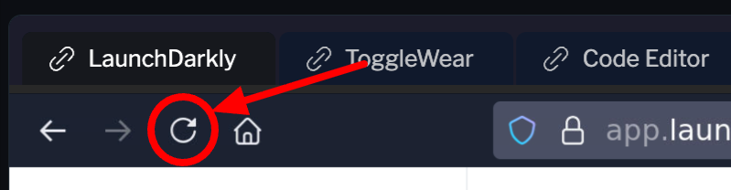

# What's already in place

Most of this challenge is already wired by the lab:

- A new variation, **Otto (Stiff)**, has been added to Otto Assistant. It's backed by Amazon Nova Pro and has a deliberately corporate-sounding prompt — formal greetings, formal sign-offs, the works.
- The **otto-brand-voice-score** metric exists — numeric, higher-is-better.
- Background traffic is flowing at ~1 session every 2 seconds. Each session emits an `otto-brand-voice-score` event biased by which model served it. Stiff's mean is well below the others.

What's *not* built is the thing that decides what "good" means. You'll ask for that, then **configure a guarded rollout** that splits traffic between Otto (Born) and Otto (Stiff), watches `otto-brand-voice-score`, and rolls back automatically if Stiff's score regresses.

# Ask for the judge

A judge is an AI Config in judge mode: a small model whose only job is scoring another model's output against criteria you wrote. In your `claude` session:

```
In my LaunchDarkly project, create an AI Config in judge mode.

Key it otto-brand-voice-judge, name it "Otto Brand Voice Judge", and back its variation with the Bedrock model anthropic.claude-haiku-4-5-20251001-v1:0.

Its evaluation metric key must be exactly $ld:ai:judge:otto-brand-voice-judge — the API rejects anything without that prefix.

Give it a system message that scores a customer service response against ToggleWear's brand voice — warm, concise, never pushy — and returns a single number between 0.0 and 1.0. Reference the response being graded as {{response}}.

Then set the default rule in the Test environment to serve that variation, so the judge is actually on.
```

Read it back before moving on:

```
Show me the otto-brand-voice-judge Config: its mode, its evaluation metric key, its variation's model and system message, and what the Test default rule serves.
```

Mode must be **judge**. It's fixed at creation, so a completion-mode judge needs deleting and recreating rather than editing.

Now wire the app to call it. In a terminal in the [Code Editor](#tab-2):

```bash
python3 /opt/ld/ai-configs-intro/terraform/evaluate-03/patch-server.py \
  && service togglewear restart
```

That drops the judge invocation into `server.py` below the marker your Challenge 01 paste left behind, so every `/chat` answer gets scored from here on.

Before you continue, due to caching in the virtual browser, you'll need to refresh the virtual browser (not your browser).



# Inspect what changed

1. Open the [LaunchDarkly](#tab-0) tab.
2. Go to **Configs → Otto Assistant**.
3. Notice the new variation **Otto (Stiff)** in the list. Click it to see the prompt — explicitly formal, the opposite of the brand voice.
4. Click the **Monitoring** tab and select **otto-brand-voice-score**. You should see scores accumulating — most of them in the high range (since most traffic still goes to Born), with no contribution from Stiff yet because Stiff isn't being served to anyone.

# Start the guarded rollout

1. Click the **Targeting** tab. Confirm the environment is **test**.
2. Click the **Default rule** (the fallthrough). You should see an option to **Start guarded rollout**.
3. Configure:
   - **Original variation**: **Otto (Born)**
   - **Target variation**: **Otto (Stiff)**
   - **Metric to watch**: **Otto Brand Voice Score**
   - **Otto Brand Voice Score**: Check **Auto rollback**
   - **Rollout duration**: 1 hour
4. Click **Review and save**, then **Save changes**.

# Watch what happens

The rollout starts at the first stage (10% Stiff). Background traffic flows through and the brand-voice score for the Stiff variation lands much lower than for Born. Within ~1-2 minutes, the rollout's regression detection should fire.

When it does:

- The rollout shows a **regression detected** event on the **Targeting** tab's rollout timeline.
- Traffic snaps back to 100% Otto (Born). The Stiff variation gets dropped.
- The monitoring view's brand-voice-score graph shows the dip during the rollout phase, then recovery after rollback.

# If you want to force it

Background traffic is intentionally low-rate so the lab fits in the time budget but doesn't burn through tokens. If the rollback doesn't fire fast enough for demo pacing, run the sabotage script from a terminal:

```bash
/opt/ld/ai-configs-intro/app/.venv/bin/python3 /opt/ld/ai-configs-intro/traffic-generator/sabotage.py
```

It emits 60 low-score events directly. The rollback usually fires within a minute of the sabotage finishing.

# What you just saw

A risky model entered production behind a metric guard. The pre-wired brand-voice judge caught the regression and rolled it back without you watching. That's the whole point: when the safety net runs itself, you can ship more aggressively.

Click **Check** when the guarded rollout is configured and running.
